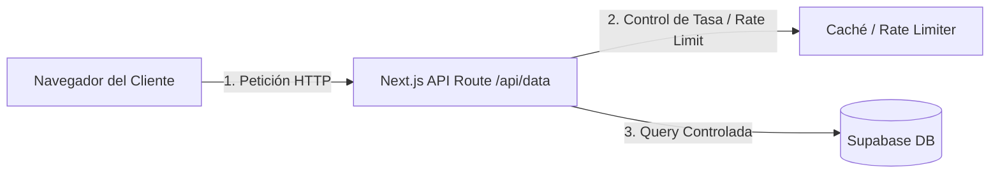

# Manual de Hardening, Rendimiento y Seguridad para el Paso a Producción (SaaS Apps)

Este manual detalla los pasos prácticos para auditar, asegurar y optimizar aplicaciones web (particularmente aquellas construidas sobre el stack **Next.js + Supabase + Vercel**) que se encuentran en fase avanzada de desarrollo y están a punto de salir al mercado.

---

## 1. Refactorización del Frontend: Adiós a las "Cards sobre Cards"

El abuso de contenedores con bordes, rellenos y sombras anidadas (`bg-card`, `shadow`, `border`) crea contaminación visual e incomodidad de lectura. Para pasar a producción, la UI debe simplificarse hacia un diseño plano e intuitivo.

### Antes (Antipatrón común en prototipos rápidos)
```tsx
// Tarjeta contenedora de la sección
<div className="bg-zinc-900 border border-zinc-800 p-6 rounded-2xl shadow-lg">
  <h3 className="text-lg font-bold mb-4">Pedidos Recientes</h3>
  <div className="space-y-4">
    {orders.map(order => (
      // Subtarjetas anidadas
      <div key={order.id} className="bg-zinc-950 border border-zinc-850 p-4 rounded-xl shadow-sm">
        <div className="flex justify-between">
          <span className="font-semibold">Pedido #{order.number}</span>
          <span>${order.total}</span>
        </div>
        {/* Detalle interno - ¡Más cajas anidadas! */}
        <div className="mt-2 bg-zinc-900 p-2 rounded-lg border border-zinc-850 text-xs">
          {order.items}
        </div>
      </div>
    ))}
  </div>
</div>
```

### Después (Diseño Plano, Tipográfico y Moderno)
```tsx
// Contenedor principal con fondo sutil sin sombra redundante
<div className="bg-zinc-950/40 border border-zinc-900 p-5 rounded-2xl">
  <h3 className="text-sm font-bold text-zinc-150 tracking-wide uppercase mb-4">Pedidos Recientes</h3>
  
  {/* Lista plana separada por líneas sutiles */}
  <div className="divide-y divide-zinc-900">
    {orders.map(order => (
      <div key={order.id} className="py-3.5 flex items-center justify-between gap-4 first:pt-0 last:pb-0">
        <div className="space-y-1">
          <h4 className="text-sm font-semibold text-zinc-200">Pedido #{order.number}</h4>
          <p className="text-xs text-zinc-500">{order.items}</p>
        </div>
        <div className="text-right">
          <p className="text-sm font-bold text-emerald-400">${order.total}</p>
          <span className="inline-block text-[10px] font-semibold text-zinc-400 uppercase tracking-widest bg-zinc-900 px-2 py-0.5 rounded">
            {order.status}
          </span>
        </div>
      </div>
    ))}
  </div>
</div>
```

### Principios clave:
* **Jerarquía tipográfica:** Usa el contraste entre `text-zinc-100` (títulos), `text-zinc-350` (cuerpo) y `text-zinc-500` (secundario) en lugar de crear bordes para separar.
* **Separadores sutiles:** Reemplaza los bordes completos de cajas por bordes inferiores (`border-b border-zinc-900`) o divisores de Tailwind (`divide-y divide-zinc-900`).
* **Micro-espaciado coherente:** En lugar de rellenos grandes en todas las tarjetas, reduce los paddings internos de las listas planas (`py-3`).

---

## 2. Paginación y Reducción de Payloads (Optimización de Ancho de Banda)

Hacer un `select('*')` en una tabla que crecerá constantemente (como `customers`, `orders` o `webhook_logs`) es una bomba de tiempo para el rendimiento y la facturación de red (egress).

### Regla de Oro
**Jamás traigas más datos de los que caben en la pantalla inicial.**

### 1. Limitar columnas estrictamente
Evita solicitar campos pesados (como JSONs de logs, descripciones largas o campos de auditoría) si solo vas a renderizar una lista general.

```typescript
// MAL: Descarga todo el peso de la base de datos
const { data } = await supabase.from('customers').select('*');

// BIEN: Solo descarga los campos que se muestran en el listado
const { data } = await supabase
  .from('customers')
  .select('id, name, phone, total_orders, total_spent');
```

### 2. Implementar paginación con `.range()` en Supabase
```typescript
// Función de carga paginada (Siguiente/Anterior o Scroll Infinito)
async function fetchCustomersPage(pageIndex: number, pageSize: number = 20) {
  const from = pageIndex * pageSize;
  const to = from + pageSize - 1;

  const { data, count, error } = await supabase
    .from('customers')
    .select('id, name, phone, total_orders, total_spent', { count: 'exact' })
    .order('total_spent', { ascending: false })
    .range(from, to);

  return { data, totalCount: count || 0 };
}
```

---

## 3. Optimización de Memoria (RAM del Servidor y Cliente)

El procesamiento y agrupación de datos debe ser realizado por el motor de base de datos (PostgreSQL), no en la RAM de la aplicación de Node.js o el navegador.

### Evitar el procesamiento de datos en código (Map/Reduce/Filter)
Si necesitas estadísticas de facturación o conteos, no consultes las filas completas para calcularlas en memoria.

#### Caso Ineficiente en JS (RAM alta):
```typescript
// Descarga 100,000 registros para hacer un cálculo simple en la RAM del servidor web
const { data: orders } = await supabase.from('orders').select('restaurant_id, status, total_price');
const totalSales = orders
  .filter(o => o.status === 'delivered')
  .reduce((sum, o) => sum + Number(o.total_price), 0);
```

#### Solución Eficiente (Consumo de RAM 0% en servidor):
Crea una **Vista en la Base de Datos (Database View)** o ejecuta agregaciones directamente con funciones de agregación en SQL.

```sql
-- Ejecuta esto directamente en Supabase SQL Editor
CREATE OR REPLACE VIEW restaurant_billing_stats AS
SELECT 
    restaurant_id,
    COUNT(id) as total_orders,
    COUNT(id) FILTER (WHERE status = 'delivered') as delivered_orders,
    SUM(total_price) FILTER (WHERE status = 'delivered') as total_sales
FROM orders
GROUP BY restaurant_id;
```

Luego, en Next.js consulta la vista directamente:
```typescript
const { data: stats } = await supabase
  .from('restaurant_billing_stats')
  .select('*')
  .eq('restaurant_id', targetId)
  .single();
```

---

## 4. Protección de la Base de Datos (Arquitectura Anti-DDoS y Spammers)

Exponer el cliente directo de Supabase (`createClient(URL, ANON_KEY)`) en el código cliente de React permite que cualquiera extraiga estas llaves de la consola de desarrollo y ataque tu base de datos mediante scripts automatizados que consuman la cuota de consultas.

### Estrategia de Mitigación:
Para operaciones críticas o sensibles a la carga, interpone un intermediario (**Next.js Route Handlers** en backend) con control de peticiones y caché.



### Implementación de Rate Limiting en Next.js Middleware o Route Handlers
Puedes usar servicios como **Upstash** o middlewares con token bucket sencillos:

```typescript
// src/app/api/admin/users/route.ts
import { NextRequest, NextResponse } from 'next/server';
import { rateLimit } from '@/lib/rateLimiter'; // Tu lógica de rate limiter

export async function GET(req: NextRequest) {
  const ip = req.ip || '127.0.0.1';
  
  // Limita a un máximo de 60 peticiones por minuto por IP
  const { success, limit, reset, remaining } = await rateLimit(ip, 60);
  
  if (!success) {
    return new NextResponse('Too Many Requests', {
      status: 429,
      headers: {
        'X-RateLimit-Limit': limit.toString(),
        'X-RateLimit-Remaining': remaining.toString(),
        'X-RateLimit-Reset': reset.toString(),
      }
    });
  }

  // Continuar con la consulta...
}
```

---

## 5. Endurecimiento de Servidores VPS (VPS Hardening)

Si decides auto-alojar partes de tu aplicación (como un servidor Node.js alternativo, una base de datos propia o un servidor de colas) en un VPS convencional (AWS EC2, DigitalOcean, etc.), sigue esta lista obligatoria antes de lanzar al público:

### 1. Deshabilitar SSH por contraseña (Solo usar Llaves Criptográficas)
Edita el archivo de configuración SSH en tu servidor:
```bash
sudo nano /etc/ssh/sshd_config
```
Busca y modifica las siguientes líneas:
```text
PasswordAuthentication no
ChallengeResponseAuthentication no
PubkeyAuthentication yes
PermitRootLogin no
```
Reinicia el servicio SSH:
```bash
sudo systemctl restart sshd
```

### 2. Cambiar el puerto SSH por defecto (Evita robots automáticos)
Modifica el puerto por defecto (22) en el archivo de configuración SSH a un puerto aleatorio alto (por ejemplo, `2284`):
```text
Port 2284
```
*Asegúrate de permitir este puerto en tu firewall antes de desconectarte.*

### 3. Configurar Firewall (UFW)
Solo permite puertos mínimos necesarios para producción:
```bash
# Permitir SSH (en el puerto personalizado)
sudo ufw allow 2284/tcp

# Permitir HTTP y HTTPS públicos
sudo ufw allow 80/tcp
sudo ufw allow 443/tcp

# Bloquear cualquier otro intento por defecto
sudo ufw default deny incoming
sudo ufw default allow outgoing

# Activar firewall
sudo ufw enable
```

### 4. Instalar Fail2ban (Bloquea ataques de fuerza bruta)
Bloquea temporalmente IPs que muestren patrones sospechosos (múltiples intentos fallidos de conexión):
```bash
sudo apt-get install fail2ban -y
sudo systemctl enable fail2ban
sudo systemctl start fail2ban
```

---

## 6. Despliegue Seguro con Terraform y WAF

### 1. Evitar la destrucción accidental de recursos de producción en Terraform
Agrega el bloque `lifecycle` con `prevent_destroy = true` en tus recursos de producción más valiosos (Bases de datos, Registros de DNS de Route53, Instancias críticas).

```hcl
resource "aws_db_instance" "prod_database" {
  # ... configuración ...
  
  lifecycle {
    prevent_destroy = true
  }
}
```

### 2. AWS WAF vs Cloudflare: Ahorro de costos y resiliencia
AWS WAF cobra un precio base de $5 USD mensuales por cada Web ACL creada, más $1 USD por regla y $0.60 USD por millón de peticiones inspeccionadas. En entornos de producción con mucho tráfico o ataques, esto infla la factura drásticamente.

* **Recomendación:** Utilizar **Cloudflare** como Proxy DNS perimetral.
  * **Costo:** El plan gratuito/Pro de Cloudflare incluye protección DDoS integrada ilimitada, reglas de WAF precargadas y optimización de tráfico (compresión y caché).
  * **Configuración:** Cambia los servidores de nombres (Nameservers) de tu dominio principal para que apunten a Cloudflare y activa la opción "Proxy" (la nube naranja). Esto ocultará la dirección IP real de tus servidores (o servidor de Supabase) frente al mundo, filtrando tráfico malicioso a nivel global antes de que toque tu aplicación.

---

## Check-list Final de Producción (Go-to-Market)

- [ ] **Políticas RLS Activas:** Todas las tablas en Supabase tienen Row Level Security activado y políticas estrictas configuradas.
- [ ] **Endpoints Saneados:** Ninguna ruta de la API expone columnas de datos sensibles (contraseñas, datos internos del sistema).
- [ ] **Paginación Implementada:** Los listados dinámicos usan límites y filtros selectivos en las queries de base de datos.
- [ ] **Rate Limiting Configurado:** Los endpoints públicos expuestos a formularios o llamadas externas limitan la tasa de peticiones por IP.
- [ ] **Manejo Seguro de Secretos:** Las variables de entorno de producción están configuradas en Vercel de manera encriptada y no se suben al control de versiones (`.env`).
- [ ] **DNS Protegido:** El dominio principal está protegido a través de Cloudflare para mitigar ataques DDoS directos.
- [ ] **Acceso VPS Restringido:** El puerto 22 SSH está deshabilitado para contraseñas tradicionales y solo acepta llaves autorizadas.
