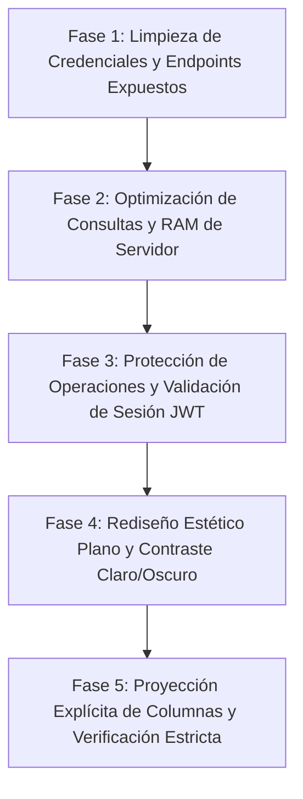

# Manual de Optimización de Seguridad, Rendimiento y Costos para Aplicaciones Web Modernas (Supabase & Next.js)

Este manual documenta el conjunto de directrices, metodologías de auditoría y técnicas de refactorización implementadas durante nuestra sesión de optimización. Está diseñado para servir como plantilla de desarrollo seguro y escalable para futuros proyectos.

---

## ÍNDICE
1. [Fases de Auditoría y Flujo de Trabajo](#1-fases-de-auditoría-y-flujo-de-trabajo)
2. [Checklist de Seguridad (API & BD)](#2-checklist-de-seguridad-api--bd)
3. [Checklist de Rendimiento y Consumo de RAM](#3-checklist-de-rendimiento-y-consumo-de-ram)
4. [Checklist de Control de Costos e Infraestructura](#4-checklist-de-control-de-costos-e-infraestructura)
5. [Estrategia de Entornos (Local, Staging, Producción)](#5-estrategia-de-entornos-local-staging-producción)

---

## 1. Fases de Auditoría y Flujo de Trabajo

Para cualquier nuevo proyecto, el proceso de saneamiento y optimización debe seguir el siguiente orden cronológico para mitigar riesgos:



### Cómo evaluar cada fase:
* **Fase 1 (Limpieza):** Analizar el árbol de archivos en busca de archivos `.md`, `.json` o `.env` que contengan contraseñas y buscar en `src/app/api` rutas de depuración desprotegidas (ej. `/api/test-ai`).
* **Fase 2 (Rendimiento):** Identificar en qué partes del backend se cargan tablas enteras en memoria RAM para procesar sumas o conteos.
* **Fase 3 (Seguridad):** Intentar realizar peticiones de escritura (`POST`, `PATCH`, `DELETE`) en las APIs usando clientes REST (como Postman) sin cabeceras de autorización. Si la API responde `200 OK`, está desprotegida.
* **Fase 4 (Estética):** Navegar por la interfaz alternando entre el modo claro y modo oscuro para verificar la legibilidad y asegurar que no existan sombras 3D pesadas o tarjetas anidadas redundantes (más de 3 niveles).
* **Fase 5 (Compilación):** Correr el compilador estricto (`npx tsc --noEmit`) para certificar la ausencia de fallos en producción.

---

## 2. Checklist de Seguridad (API & BD)

### ☐ 2.1 Eliminación de Credenciales y Rutas de Prueba Expuestas
* **Problema:** Los desarrolladores suelen dejar archivos de texto con contraseñas o endpoints sin autenticación (ej: `/api/test`) para verificar respuestas rápidamente en desarrollo. Si se suben a Git, quedan expuestos para siempre.
* **Solución:** 
  1. Eliminar archivos de credenciales físicos y agregarlos a `.gitignore`.
  2. Borrar del proyecto las rutas de API que sirvieron únicamente para depuración.
* **Cómo evaluarlo:** Ejecutar búsquedas globales en el proyecto buscando strings como `"apikey"`, `"password"`, `"secret"`, o inspeccionar la carpeta `src/app/api`.

### ☐ 2.2 Validación de Tokens de Sesión (JWT) en APIs de Escritura
* **Problema:** Exponer APIs de modificación (como cambiar el estado de un pedido `/api/orders/[id]`) permite que cualquier persona que conozca el ID de la orden altere la base de datos simulando peticiones HTTP.
* **Solución:**
  1. Extraer el token de portador (*Bearer Token*) de las cabeceras HTTP en el backend.
  2. Utilizar el SDK de la base de datos (Supabase Auth) para descifrar el JWT y validar la identidad del usuario y sus permisos en el servidor antes de realizar la acción.
* **Ejemplo en código (Next.js route.ts):**
  ```typescript
  import { supabase } from '@/lib/supabase';
  
  export async function PATCH(req: Request) {
    const authHeader = req.headers.get('Authorization');
    if (!authHeader || !authHeader.startsWith('Bearer ')) {
      return new Response('No autorizado', { status: 401 });
    }
    const token = authHeader.split(' ')[1];
    
    // Validar token con Supabase en el backend
    const { data: { user }, error } = await supabase.auth.getUser(token);
    if (error || !user) return new Response('Sesión Inválida', { status: 401 });
    
    // Proceder con la query...
  }
  ```

### ☐ 2.3 Selección Explícita de Columnas (Evitar `SELECT *`)
* **Problema:** Usar `select('*')` en tablas grandes descarga columnas pesadas (ej: texto libre de preferencias, metadatos, datos de auditoría) que la interfaz no necesita. Aumenta la vulnerabilidad de fuga de datos privados y eleva los costos de red.
* **Solución:** Reemplazar siempre las llamadas generales por listados explícitos de columnas requeridas por el renderizador.
* **Cómo evaluarlo:** Buscar `.select('*')` en tu código y reemplazarlo por la lista exacta de campos necesarios.
* **Ejemplo (Supabase Client):**
  ```typescript
  // MALO (Fuga de datos y payload pesado)
  const { data } = await supabase.from('customers').select('*');
  
  // CORRECTO (Optimizado y seguro)
  const { data } = await supabase
    .from('customers')
    .select('id, name, phone, total_orders, total_spent');
  ```

### ☐ 2.4 Habilitar Row Level Security (RLS) en la Base de Datos
* **Problema:** En arquitecturas de Supabase, las claves anon de la API son públicas en el frontend. Si RLS está desactivado, un usuario puede inyectar código en la consola del navegador y borrar tablas enteras.
* **Solución:** Activar RLS en todas las tablas y crear políticas basadas en la sesión del usuario (`auth.uid()`).
* **Cómo evaluarlo:** Ejecutar en el panel de control de base de datos SQL:
  ```sql
  ALTER TABLE nombre_tabla ENABLE ROW LEVEL SECURITY;
  ```

---

## 3. Checklist de Rendimiento y Consumo de RAM

### ☐ 3.1 Procesamiento Agregado en Base de Datos (SQL Views)
* **Problema:** Procesar sumatorias, promedios o conteos en arrays usando Javascript (`.reduce()`) requiere transferir miles de filas del servidor de base de datos a la memoria RAM de tu servidor de API Next.js.
* **Solución:** Crear **Vistas SQL** o consultas agregadas (`SUM`, `COUNT`) directamente en la base de datos. El servidor de la API solo recibirá el número calculado final.
* **Cómo evaluarlo:** Si la API del backend tarda más tiempo a medida que la base de datos acumula registros, el procesamiento se está haciendo en memoria en lugar del motor de base de datos.
* **Ejemplo en PostgreSQL:**
  ```sql
  CREATE OR REPLACE VIEW restaurant_billing_stats AS
  SELECT 
    restaurant_id,
    COUNT(*) AS total_orders,
    SUM(total_price) FILTER (WHERE status = 'delivered') AS net_revenue
  FROM orders
  GROUP BY restaurant_id;
  ```

### ☐ 3.2 Prevención del Problema de Consulta N+1
* **Problema:** Hacer una consulta para obtener una lista de elementos (ej. 100 pedidos) y luego, dentro de un bucle de Javascript, hacer una consulta por cada pedido para traer sus productos. Esto genera 101 llamadas de red separadas, colapsando el servidor por latencia.
* **Solución:** Utilizar JOINs nativos de SQL o las consultas de anidamiento de Supabase para traer los datos relacionados de una sola vez.
* **Cómo evaluarlo:** Revisar el código en busca de consultas de base de datos dentro de ciclos `map`, `forEach` o `for`.
* **Ejemplo (Supabase):**
  ```typescript
  // Supabase compila este select con relaciones anidadas en una única llamada SQL optimizada
  const { data } = await supabase
    .from('orders')
    .select(`
      id,
      total_price,
      order_items (
        quantity,
        menu_items ( name )
      )
    `);
  ```

### ☐ 3.3 Paginación y Límites de Seguridad en Consultas
* **Problema:** Permitir que las consultas de lectura a históricos traigan todos los registros sin límites establecidos en el código.
* **Solución:** Forzar un límite máximo en cada consulta y calcular el rango (`range` o `offset`) defensivamente.
* **Ejemplo de cálculo de Rango (Supabase):**
  ```typescript
  const page = 1;
  const limit = 20;
  const from = (page - 1) * limit;
  const to = from + limit - 1; // Rango inclusivo
  
  const { data } = await supabase
    .from('orders')
    .select('*')
    .range(from, to);
  ```

---

## 4. Checklist de Control de Costos e Infraestructura

### ☐ 4.1 Protección de Consumos (Egress) Mediante Caché CDN
* **Problema:** Peticiones masivas constantes a tablas estáticas (como la lectura de la carta/menú del restaurante) consumen ancho de banda de base de datos y cuotas de transferencia pagas.
* **Solución:** Crear una API Route en Next.js para esos datos estáticos y configurar cabeceras de control de caché para que la CDN del hosting (Vercel) sirva el contenido desde la caché del borde (*Edge Cache*).
* **Ejemplo de cabecera de caché en Next.js API:**
  ```typescript
  export async function GET() {
    const { data } = await supabase.from('menu_items').select('id, name, price');
    
    return new Response(JSON.stringify(data), {
      headers: {
        'Content-Type': 'application/json',
        'Cache-Control': 'public, s-maxage=3600, stale-while-revalidate=86400'
      }
    });
  }
  ```

### ☐ 4.2 Rate Limiting (Limitador de Peticiones)
* **Problema:** Ataques automatizados golpeando endpoints críticos de envío de mensajes, simulaciones o creación de pedidos de forma repetida.
* **Solución:** Implementar limitadores de tasa (usando Redis en el backend con herramientas como Upstash Rate Limit o middlewares de Next.js) para rechazar conexiones sospechosas que hagan más de N peticiones por minuto.

### ☐ 4.3 Alertas y Límites de Consumo Financiero
* **Problema:** Ataques DDoS consumiendo cuotas en la nube que derivan en facturas sorpresa de miles de dólares al final del mes.
* **Solución:** Acceder manualmente a las consolas de **Vercel** y **Supabase** para configurar:
  1. Alertas de correo cuando el gasto acumulado alcance el 80% del límite gratuito.
  2. Activar la opción de **"Spend Limits"** para apagar o pausar automáticamente el proyecto si se supera un gasto máximo (ej. $10 USD) para evitar deudas incontrolables.

---

## 5. Estrategia de Entornos (Local, Staging, Producción)

El desarrollo profesional requiere aislar los entornos para proteger a los usuarios en producción:

```
+-----------------------------------------------------------------------+
|  1. AMBIENTE LOCAL (Tu Computadora)                                   |
|  - Código de prueba, simuladores de APIs locales (Meta, Stripe).      |
|  - Costo: $0.                                                         |
|  - Comando: npm run dev                                               |
+-----------------------------------------------------------------------+
                                  |
                                  v
+-----------------------------------------------------------------------+
|  2. STAGING (Vista Previa / Vercel Preview)                           |
|  - Servidor idéntico a producción pero de acceso privatizado.         |
|  - Se verifica la UI (Modo Claro/Oscuro) y la respuesta del servidor. |
|  - URL única por rama: https://restaurante-preview.vercel.app         |
+-----------------------------------------------------------------------+
                                  |
                                  v
+-----------------------------------------------------------------------+
|  3. PRODUCCIÓN (Servidor de Verdad)                                   |
|  - Base de datos real con transacciones comerciales de clientes.       |
|  - Solo se despliega cuando la compilación (tsc) pasa a costo cero.   |
|  - URL oficial: https://restaurante-ia-sand.vercel.app                |
+-----------------------------------------------------------------------+
```

### Regla de Oro de Base de Datos para el Futuro:
Para proyectos en crecimiento, **nunca compartas la misma base de datos de Supabase para desarrollo y producción**. Configura dos proyectos separados en Supabase y alterna sus credenciales en el archivo de variables de entorno correspondientes (`.env.local` vs `.env.production`). Esto garantiza que una prueba local errónea nunca borre datos reales de tus usuarios finales.
